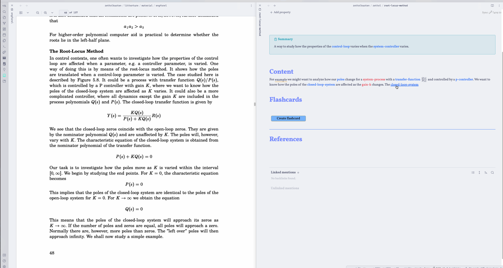
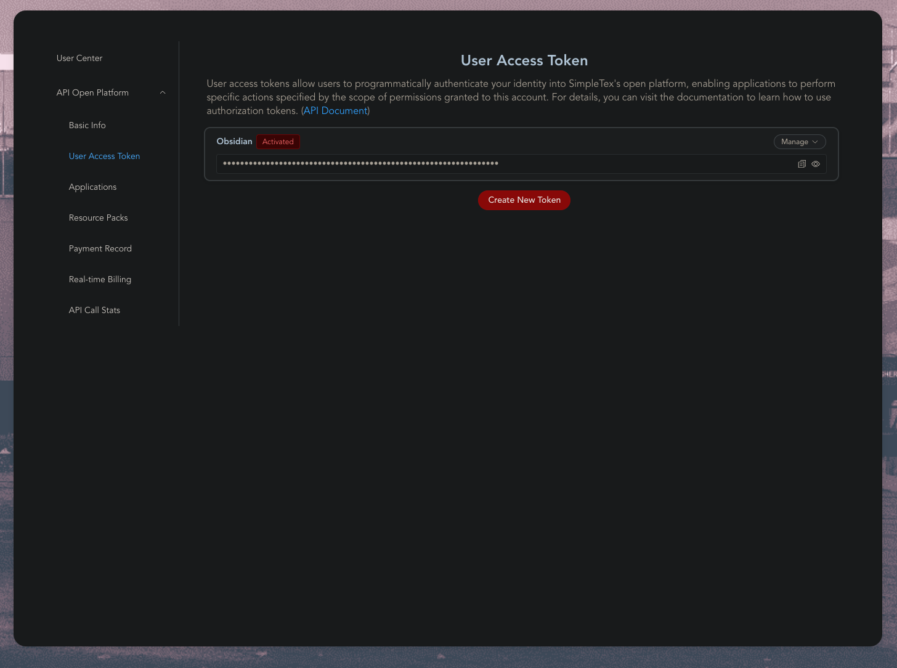

# About 🗞️

This extension takes your latest copied image from your clipboard and either converts it to Markdown or MathJax. The extensions have three different OCR providers that you can pick between
1. [Texify](https://github.com/VikParuchuri/texify) (Recomended) - Self Hosted service that convert your image to Markdown
2. [SimpleTex](https://update.simpletex.cn/) - Hosted service that converts converts your image to Latex wrapped in Math Block
3. [pix2tex](https://github.com/lukas-blecher/LaTeX-OCR) - Self Hosted service that converts your image to Latex wrapped in Math Block
   
See GIF below for example of usage with a keybinding:

A couple of things happen here

1. I take a screenshot of the formula on the left
2. I use a keybinding to trigger the OCRToLatex
3. A loading indicator is inserted

# Setup 🚀

To get started first get an api token, see below. Then go to settings and insert it. After this you are ready to use the plugin. Try to snip a math formula to your clipboard and run the command `Generate latex from last image to clipboard
## Texify ⭐
This provider requires you to self host it, if you don't have a server or a computer that can run the model I would recomend using SimpleTex instead.

To setup this project clone the repo [texify-wep-api](https://github.com/Hugo-Persson/texify-wep-api) and follow the setup for that project. Now a web service will be exposed and you can paste the URL into the field `url` in Obsidian settings. If you run on localhost this will be ´localhost:5000` but you could host this on your own server and you would then use the appropiate URL. 

**Note:** The first request to Texify will be slow because the model needs to be loaded, after the first request the API will much faster. 
## SimpleTex
### Getting API Token 🔐

To use this plugin you need to create a developer account at https://simpletex.cn. Below I describe how to do this

1. Go to https://simpletex.cn/api
2. Click "Go to API Dashboard"
3. Create an account
4. After this go to `User Access Token` and click `Create token`
5. Copy the token and paste into Obsidian settings 
6. Now you are ready to use the addon 🥳

## Pix2Tex 
This is an self hosted alternative to SimpleTex. There are two main way to host it, either your run through Docker or host directly with python. 
**Note:** Docker does not work on ARM, for example M series MacBooks, use Python instead.
### Docker 🐳
You can host Pix2Tex in Obsidian by using Docker. This is well explained in their docs https://hub.docker.com/r/lukasblecher/pix2tex

### Python 🐍
You can run the project directly with Python by
1. Installing the package with `pip install pix2tex[api]`
2. Running the Web Api with: `python -m pix2tex.api.run`

### Configuring Obsidian 

Enter the URL to the container, you need to postfix `/predict/` e.g. `http://localhost:8502/predict/`
**Optional**: add username and password, if container is behind a basic auth proxy (e.g. [nginx](https://nginx.org/en/docs/http/ngx_http_auth_basic_module.html))

# Future improvements ✅

-   [ ] Convert already pasted images

# Contributing or requesting feature 😍
- If you are missing something from the Plugin, please open an Issue
- If you wish to contribute, please open a PR

# Attribution 🙏

Thanks to these libraries and services for making this plugin possible

-   https://www.npmjs.com/package/node-fetch
-   https://www.npmjs.com/package/form-data
-   https://simpletex.cn/
-   https://github.com/Hugo-Persson/texify-wep-api
-   https://github.com/VikParuchuri/texify
-   https://github.com/lukas-blecher/LaTeX-OCR
